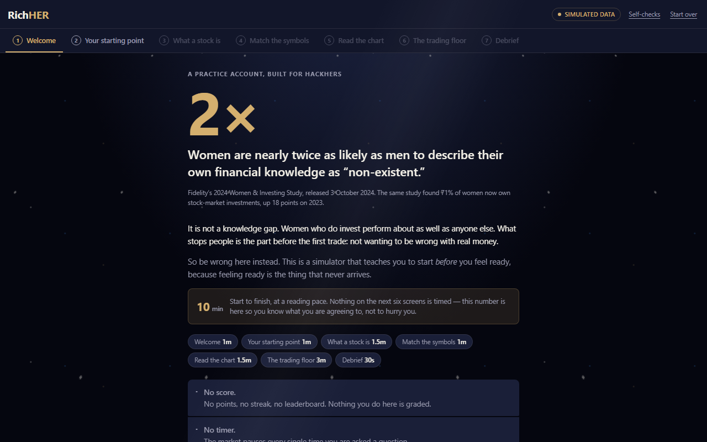
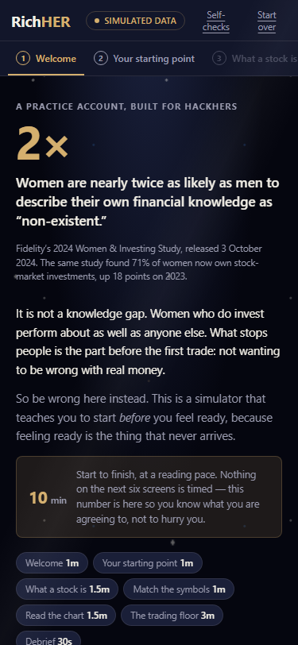

# Rich-HER

<p align="center">
  <b>A trading simulator that teaches women to start investing before they feel ready.</b><br>
  Built for HackHERS.
</p>

> *Hesitation, not ignorance, is the barrier. So there is no "I don't know" button anywhere in this product, no score, and no timer.*

<p align="center">
  
  
</p>

---

## 🚀 Quick Start

Run the application locally without any dependencies or internet connection:

```bash
python dev.py setup     # Install everything, once
python dev.py run       # Start the app
```

Open <http://127.0.0.1:8000>. One process serves both the API and the web frontend. **It runs with Wi-Fi off** — no CDN, no web fonts, no requests to any outside server. Perfect for live demos at a judging table!

```bash
python dev.py test      # Run the 202 unit tests (under a second)
python dev.py check     # Run tests + fixtures + browser checks.
```

`dev.py` automatically manages a local `.venv` (virtual environment) so you never need to activate anything yourself.

---

## 📚 Where to start, by who you are

| You are | Read | What it gives you |
|---|---|---|
| **Building the frontend** | [API.md](API.md) | Every route, the shape of the data it returns, the error table |
| **New to this codebase** | [ONBOARDING.md](ONBOARDING.md) | Reading order, Python→JS translations, a safe first change to make |
| **Writing story or copy** | [STORY.md](STORY.md) | Characters, the wager, the six endings, the scene format |
| **Deciding what to build** | [docs/SPEC_3.md](docs/SPEC_3.md) | The thesis, the design rules, what's still undecided |
| **Designing screens** | [docs/WORKFLOW.md](docs/WORKFLOW.md) | The full user flow, act by act |

---

## 🛠️ What actually works right now

This project is fully functional, demo-ready, and covered by a robust test suite.

**Working, demoable, and covered by tests:**

- A **$100** practice account on **VOLT**, or **$10,000** on five other simulated markets.
- A price replay where the future stays hidden, advancing one day at a time.
- The **Tap-to-Explain** order ticket: a box explaining the downside, locking the Confirm button for 1.5 seconds to encourage reading.
- The **Safety Net**: A customizable stop-loss prompt that mathematically evaluates user trades and triggers realistically.
- Fast-forward logic that pauses exactly when significant market events or coach interventions happen.
- **Three difficulty tiers**, two comprehension checks, and the "shadow benchmark" (comparing your real performance against what would have happened if you ignored your safety net).
- **Server-Authoritative State:** If the server restarts or you refresh the page, the browser replays the log and your session restores perfectly.

---

## 🏗️ Architecture: The Browser Never Does Math

**The one rule that explains most design decisions:**
> *The browser never calculates anything about money.*

Not the price, not the fill, not the profit, not how the story ends. Every action you take sends a request to the server. The server recalculates everything and sends back the complete new state. The browser throws away what it had and redraws.

If you ever catch yourself writing `price * quantity` in `index.html` or JS, **stop** — that number should come from the server!

---

## 📈 The Universe of Symbols

The companies inside this simulator are completely fictional. Every price is synthetic (computer-generated), created by `scripts/build_fixtures.py`. 

| Ticker | Company | Starting cash | What happens |
|---|---|---|---|
| **VOLT** | Voltaic Cell Co. | **$100** | Swings hardest in both directions. This is the **primary story fixture**. |
| **HLX**  | Helix Biolabs | $10,000 | Moves on its own news, on its own days. Used for the tier demo. |
| **KIN**  | Kindred Grocers | $10,000 | People buy food in every kind of week. It moves slowly. |
| **CASA** | Casa Coffee Group | $10,000 | Enough shops to be steady, small enough to still get knocked about. |
| **MERI** | Meridian Power | $10,000 | A utility. Dull on purpose, which is a feature and not a flaw. |
| **ORB**  | Orbit 500 Fund | $10,000 | Not a company. One purchase that owns a slice of five hundred of them. |

Fixtures are **generated, never hand-edited.** Running `--check` rebuilds them from scratch and fails loudly if what's on disk doesn't match to prevent manual tampering.

---

## 📂 Layout

```
server/
  sim_engine.py        The market math (Pure, no I/O. Start here.)
  story_engine.py      Scenes, flags, endings (Pure, no I/O)
  main.py              API Routes, Session management
  tests/               202 tests
fixtures/*.json        The synthetic market data (auto-generated)
scripts/
  build_fixtures.py    Generates the fixtures deterministically
web/
  index.html           The entire frontend in one standalone file.
  coach.json           Coach Nia: her persona and pop-out copy
  scenes/*.json        The story: Act 4, the six endings
```

**Content lives in JSON, not in code.** `coach.json`, `scenes/*.json`, `tiers.json`, and `checks.json` hold the actual words and rules. You can change what the app says without touching a single `.py` or `.js` file.

---


## 📄 License
MIT License
