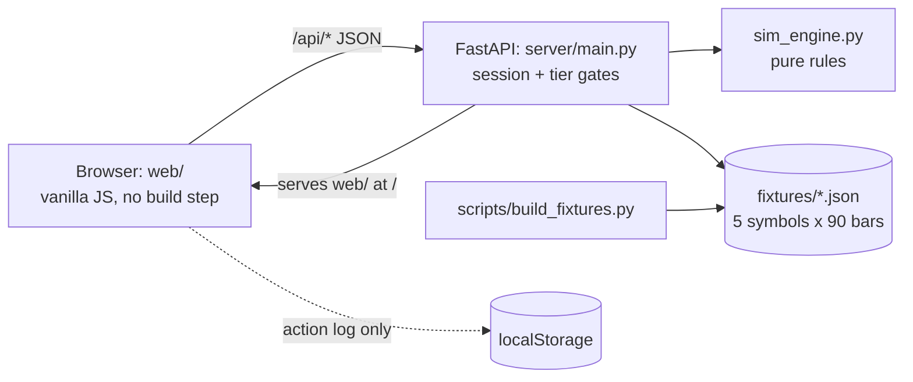

# Rich-HER (Astra Trading)

**A trading simulator that teaches what you could lose before what you could gain.** Built for HackHERS.

> *"Don't just teach people how to make money. Teach them how not to lose it."*

> **Status: dry-run build.** This repo is the working scaffold called for in [Optimization Pass 2](OPTIMIZATION_PASS_2.md) (next action #5) to test the architecture before HackHERS. It is **not** the hackathon submission. HackHERS's pre-work rules are unconfirmed, so do not reuse this code at the event until V2 confirms them. Mock mode only: no Alpaca, no live data.

<p>
  
  
</p>

## What it does

Most trading apps lead with upside. Rich-HER leads with the downside. You get $10,000 of pretend money and a price **replay where the future is hidden**. You buy, you read what you could lose *before* you confirm, and you fast-forward into a real-feeling drawdown. When a position is down 8%, a one-tap **safety net** offers to sell automatically if it falls to 10%. Afterwards a **shadow benchmark** shows what ignoring the net would have done, in both directions: sometimes it saved you, sometimes it cost you.

Progress is earned by understanding, not by trading more: a quick check after your first trade unlocks Tier 2, and a check after your first safety net unlocks Tier 3.

## Architecture



## Key features

- **Downside-first everywhere.** Every hint, ticket and prompt states the loss before the function. A lint test fails the build if a hint doesn't.
- **Walk into the dip.** Deterministic replay, one day at a time. Fast-forward stops the instant something happens, so a fill or the prompt can't be skipped.
- **Tap-to-Explain ticket.** Tap Buy, read the amber downside box and "most you could lose", wait 1.5 s, then confirm.
- **Safety net at every tier.** The −8% prompt is a guardrail, not a reward; tiers unlock *control* over it.
- **Server-authoritative.** The browser never computes a fill. After a server restart it replays its saved action log and the session comes back exactly.
- **Offline.** No CDN, no web fonts, no external requests: it runs with Wi-Fi off.
- **Honest data.** Prices are synthetic and labeled that way in the UI.

## Tech stack

| Layer | Technology | Why |
|---|---|---|
| Backend | Python 3.10+, FastAPI, Uvicorn | Small, readable, type-checked request bodies. |
| Rules | `server/sim_engine.py`, standard library only | Pure functions: unit-testable and portable to Go/C++. |
| Data | Seeded generator → `fixtures/*.json` | Byte-identical on every machine; the dip is guaranteed. |
| Frontend | Vanilla JS modules, SVG, CSS | No build step, no dependencies, nothing to break on stage. |
| Tests | pytest, a route smoke test, a headless-browser check | 60 unit/API tests plus an end-to-end run. |

## Getting started

**Prerequisites:** Python 3.10+ and Git. (Node 22+ and Edge/Chrome are needed only for the optional browser test.)

```bash
git clone https://github.com/tokunboajayi/Astra-trading.git
cd Astra-trading
python -m venv .venv
source .venv/bin/activate            # Windows: .venv\Scripts\activate
pip install -r server/requirements.txt
python -m uvicorn server.main:app --port 8000
```

Open **http://127.0.0.1:8000**. One process serves the API and the app.

### Run the tests

```bash
python -m pytest                     # 60 tests: engine, fixtures, API flows, content lint
bash server/smoke-test.sh            # every route on a running server (start it first; use a scratch server)
python scripts/build_fixtures.py --check      # fixtures match a fresh build
node scripts/e2e-browser.mjs         # optional: the whole flow in a headless browser
```

### Two-server mode

```bash
# terminal 1
python -m uvicorn server.main:app --port 8000
# terminal 2
cd web && python -m http.server 5500          # open http://127.0.0.1:5500
```

The frontend finds the API at `http://127.0.0.1:8000` unless it is served from port 8000. Override with `?api=https://your-backend` or `window.RICHHER_API`.

### Troubleshooting

| Symptom | Fix |
|---|---|
| Blank page when you double-click `index.html` | ES modules need HTTP. Use one of the two modes above. |
| "Failed to load module script … MIME type" (Windows) | Use the single-server mode; it forces the right `.js` type. |
| Port 8000 is busy | `--port 8001`, then open `http://127.0.0.1:8001/?api=` (an empty `api` means same-origin). |
| "The replay cannot start" card | The server isn't running. Start it with the `uvicorn` command above. |
| You want a clean slate for the next person | Click **Reset demo** (top right). |

## The 2:15 demo

Buy 10 AAPL at **$168.00** → fast-forward until the prompt appears on Day 54 (**$154.17**, down $138.30) → protect the position at **$151.20** → the net sells on Day 55 → by Day 61 the price is **$132.96** and the shadow line says the net saved **$182.40**. Full script with timings: [SPEC.md §12](SPEC.md#12-demo-script-215).

## Team and ownership

| Role | Who | Owns |
|---|---|---|
| **B** Backend + project lead | Tokunbo (AJ), `tokunboajayi53@gmail.com` | `server/`, `scripts/`, `fixtures/` |
| **F** Frontend | Collaborator 1, `loku.cs.agrawal@gmail.com` (shell, styles, chart) · Collaborator 2, `halfdoneburntpancake@gmail.com` (app state, order ticket) | `web/index.html`, `index.css`, `app.js`, `chart.js`, `order-ticket.js`, `format.js` |
| **V1** Content and UX | Collaborator 3, `ubaniebereo@gmail.com` | `web/hint.js`, `hints.json`, `checks.json`, `money-flow.js`, `safety-net.js` |
| **V2** Validation, pitch, Devpost, domain | **Unassigned** | `web/tier-picker.js`, `tiers.json`, the deck, Devpost, stranger-QA, the `.tech` domain, HackHERS rules |

Two open items for AJ ([Optimization Pass 2](OPTIMIZATION_PASS_2.md), action #2): who is V2, and whether F is one person or two.

## Documentation

| Doc | What is in it |
|---|---|
| [SPEC.md](SPEC.md) | The contract: architecture, engine rules, API, tiers, demo script, hosting. |
| [WHITE_PAPER.md](WHITE_PAPER.md) | The vision, the problem and the teaching approach. |
| [NEEDED.md](NEEDED.md) | The deliverables checklist, pre-event actions and open decisions. |
| [SUMMARY.md](SUMMARY.md) | What changed in the refactor, what was verified, and what still needs a decision. |
| [OPTIMIZATION_PASS_2.md](OPTIMIZATION_PASS_2.md) | The review that shaped this build. [SPEC.md Appendix A](SPEC.md#appendix-a-optimization-pass-2-traceability) maps each finding to where it is resolved. |

## Targets

3 of 3 clean offline rehearsals · demo under 2:30 · at least 4 of 5 stranger-testers answer the stop-loss check correctly first try · every hint downside-first · Devpost locked by H+22.

## License

MIT, as declared in the project's original `package.json`. There is no `LICENSE` file yet.
