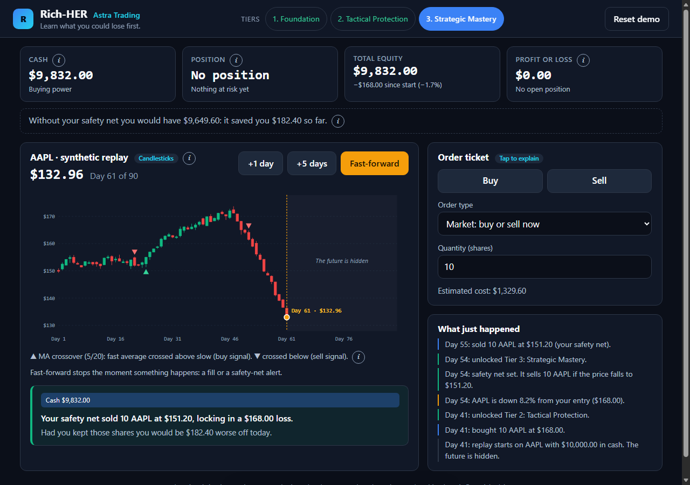
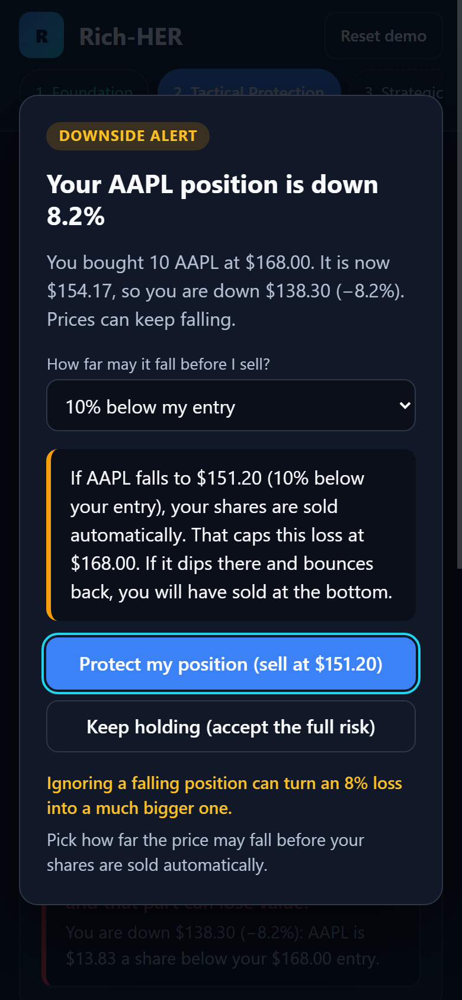

# Rich-HER

**A trading simulator that teaches women to start investing before they feel ready.** Built for HackHERS.

> Hesitation, not ignorance, is the barrier. So there is no "I don't know" button anywhere in this product, no score, and no timer.

<p>
  
  
</p>

---

## Run it

```bash
python dev.py setup     # install everything, once
python dev.py run       # start the app
```

Open <http://127.0.0.1:8000>. One process serves the API and the page. **It runs with Wi-Fi off** — no CDN, no web fonts, no requests to any outside server.

```bash
python dev.py test      # 197 tests, under a second
python dev.py check     # tests + fixtures + browser. Run before committing.
```

`dev.py` always uses the project's own `.venv` (its private copy of Python's packages), so you never need to activate anything yourself.

New to this codebase? [ONBOARDING.md](ONBOARDING.md) has a backend track and a frontend track, each about an hour.

---

## Where to start, by who you are

| You are | Read | What it gives you |
|---|---|---|
| **Building the frontend** | [API.md](API.md) | Every route, the shape of the data it returns, the error table |
| **New to this codebase** | [ONBOARDING.md](ONBOARDING.md) | Reading order, Python→JS translations, a safe first change to make |
| **Writing story or copy** | [STORY.md](STORY.md) | Characters, the wager, the six endings, the scene format |
| **Deciding what to build** | [docs/SPEC_3.md](docs/SPEC_3.md) | The thesis, the design rules, what's still undecided |
| **Designing screens** | [docs/WORKFLOW.md](docs/WORKFLOW.md) | The full user flow, act by act |

Older material that a newer document replaced lives in [docs/archive/](docs/archive/). It's kept so we can see how decisions changed over time — **don't build against it.** `SPEC_v3.0.md` in particular describes an earlier version of the product (a $10,000 account with a "lead with the downside" framing) that [docs/SPEC_3.md](docs/SPEC_3.md) replaced.

---

## What actually works right now

Worth being precise about, because the design docs describe more than the app currently does.

**Working, demoable, and covered by tests:**

- A $100 practice account on NVX, $10,000 on the other five fixtures (a "fixture" here means one company's 90 days of made-up price data — see below)
- A price replay where the future stays hidden, one day at a time
- The Tap-to-Explain order ticket: a box explaining the downside, and the Confirm button locked for 1.5 seconds so you can't click through without reading it
- The −8% safety net: a prompt that appears when a position drops 8%, with every number computed from your actual trade
- Fast-forward that stops the instant something happens, so you never blow past an important moment
- Three difficulty tiers, two comprehension checks, and the "shadow benchmark" (what would have happened if you'd ignored the safety net)
- The whole story layer, reachable through the API: scenes, choices, flags, six possible endings
- Restart recovery — if the server restarts, the browser replays its saved log and your session comes back exactly as it was

**Designed, but not yet built as an actual screen** (the API already supports all of it):

- The four opening screens: the statistic, the experience question, the name prompt, Vela's arrival
- Vela's checkpoints and the animated scene transitions between chapters
- Dialogue for Acts 1, 2, 3, 5, and 6 — only Act 4 is written so far

---

## The one rule that explains most design decisions

**The browser never calculates anything about money.**

Not the price, not the fill, not the profit, not how the story ends. Every action you take sends a request to the server. The server recalculates everything and sends back the complete new state. The browser throws away what it had and redraws from that.

If you ever catch yourself writing `price * quantity` in a `.js` file, stop — that number should have come from the server.

---

## The companies are fictional

**HLX, BRW, BRD, KIN, NVX, and VLT are made up.** Every price is synthetic (computer-generated, not real market data), created by `scripts/build_fixtures.py`. Every fixture file says `"synthetic": true`, and the app says so on screen too. None of it refers to a real listed company — so there's no number anyone could fact-check against the real market.

| Ticker | Company | Starting cash | What happens |
|---|---|---|---|
| **NVX** | Novexa Systems | **$100** | Dips −10%, ends **+25%**. This is the story fixture — used in the narrative. |
| HLX | Helix Devices | $10,000 | Steady climb, then a −22.7% pullback. Used for the tier demo. |
| BRW | Brightwater Coffee | $10,000 | Slow and steady, ends +3.9% |
| BRD | Broadline 500 Fund | $10,000 | A broad index fund — shallow dips |
| KIN | Kinetic Apparel | $10,000 | Choppy, with a −14% dip in the middle |
| VLT | Voltaic Motors | $10,000 | Big swings, ends −27.3% |

Fixtures are **generated, never hand-edited.** Running `--check` rebuilds them from scratch and fails loudly if what's on disk doesn't match — that's how we catch someone accidentally editing a data file by hand.

---

## Layout

```
server/
  sim_engine.py        the market maths       - pure, no I/O. Start here.
  story_engine.py      scenes, flags, endings - pure, no I/O
  main.py              routes, session, snapshot()
  tests/               197 tests
fixtures/*.json        the synthetic market data
scripts/
  build_fixtures.py    generates the fixtures (deterministic — same input, same output, always)
  e2e-browser.mjs      59 checks run in a real browser
web/
  index.html           the page
  tokens.css           the design system - use the variables, never a raw hex code
  app.js               browser coordinator
  coach.json           Coach Nia: her persona and pop-out copy
  scenes/*.json         the story: Act 4, the six endings
```

("Pure" means the file does no I/O — no reading files, no network calls, no clock, no randomness. Just plain functions that take input and return output. That makes it easy to test and easy to reason about.)

**Content lives in JSON, not in code.** `coach.json`, `scenes/*.json`, `tiers.json`, and `checks.json` hold the actual words and rules. Both the server and the browser read the same files, so the screen and the server can never disagree with each other. **You can change what the app says without touching a `.py` or `.js` file.**

---

## Why the tests are strict about wording

The build fails if the content breaks one of our principles:

- an "I don't know" / skip / unsure option shows up anywhere
- any kind of scoring field shows up anywhere
- a mentioned loss has no next step suggested alongside it
- a scene showing a drawdown (a drop in value) has no recovery scene after it
- a scene is a dead end, or a `goto` (a link to another scene) points nowhere

**And most importantly: any dollar figure drifts from what the fixture data actually produces.** The coach quotes exact numbers on screen. If someone regenerates the fixtures, those numbers can shift — and if that happens during a live demo in front of judges, it's a disaster. Catching it in our automated tests instead means it never reaches a demo.

If a test complains about your sentence, it's doing its job — fix the sentence, not the test.

---

## Before you demo

1. **Clear the browser cache once** before the first run. `web/` is served with caching off now, but a browser that loaded this app earlier may still hold old JavaScript and will show stale text with no error explaining why. Ctrl+Shift+Delete, or use a fresh browser profile. Once is enough.
2. **Keep only one tab open.** Tabs share `localStorage`, so a second tab can replay the first tab's saved session and switch symbols underneath you mid-demo.
3. **Don't run `python dev.py check` just before presenting.** The browser test takes over port 8000 and shuts down your demo server.
4. **Hit "Reset demo"** between participants — don't just refresh the page. A refresh replays the previous session's saved log, so you'll see stale data.
5. Run on **localhost with Wi-Fi off**. Never present from a hosted URL — venue Wi-Fi is not something to bet a demo on.
6. The server holds **one global session** — meaning only one person can use it at a time.

The guided walk-through is **NVX** ($100) and it's pre-selected, so Start goes straight there. **HLX** ($10,000) is the tier demo — the safety net, the three tiers, the deeper drop.

---

## Known open items

- **The statistic on the opening screen is unverified.** The 63% / 43% figures trace back to the *Fearless Woman* research (Bucher-Koenen, Alessie, Lusardi & van Rooij, NBER), but the exact numbers haven't been checked against the original source yet. **Don't put them on a slide until someone has confirmed them.**
- One global session works fine for a demo, but would be wrong for real, concurrent users.
- Open orders don't reserve cash, so two orders could both be validated against the same money. A later fill gets cancelled cleanly, but the user isn't warned about this up front.
- `docs/archive/` refers to an `OPTIMIZATION_PASS_2.md` file that was never actually committed to this repo — so that link won't resolve.

## License

MIT, as declared in the original `package.json`. There is no `LICENSE` file yet.
