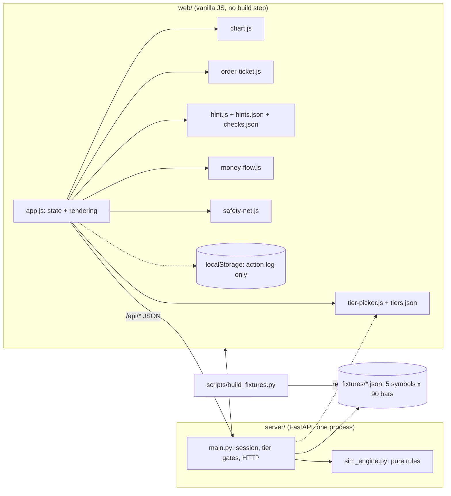

# Rich-HER (Astra Trading): Technical Specification

> **SUPERSEDED — do not follow.** This describes an earlier product: a $10,000 account
> and a downside-first framing. It was replaced by [SPEC_3.md](../SPEC_3.md). Kept for
> traceability only.

**Version:** 3.0 · **Supersedes:** 2.0 (Node.js build) · **Status:** dry-run baseline. This is the contract the team freezes after the 3–4-week dry run (see [section 0](#0-status-and-scope)).

Rich-HER teaches downside-first risk literacy. A user trades $10,000 of pretend money through a price replay where the future is hidden, and a one-tap safety net steps in when a position is down 8%.

---

## 0. Status and scope

- **This is the dry-run build**, called for in Optimization Pass 2 (not in this repo) (next action #5). It tests the architecture before HackHERS. It is not the hackathon submission.
- **Mock mode only.** No Alpaca, no live data. Architecture leaves room for both; neither is built.
- **Pre-work rules are unconfirmed.** Most hackathons require code to be written during the event. V2 must confirm HackHERS's rules before any of this code or content is reused at the event (Optimization Pass 2, loophole #9). What carries over regardless: this contract, the timings, and the lessons.
- **Sources.** Derived from the prototype README and Optimization Pass 2. `API_CONTRACT.md`, which the prototype README says it matches, was not available; section 8 is a fresh contract derived from the described behaviour. Reconcile it if `API_CONTRACT.md` differs. Interpretations made where the README was terse are listed in [Appendix B](#appendix-b-interpretations-to-confirm).

## 1. Principles

| # | Rule | How it is enforced |
|---|---|---|
| 1 | **Downside first.** Every hint, tooltip and order confirmation says what you could lose before what it does: `[What you could lose]. [What it does].` | `server/tests/test_content.py` fails if a hint's first field is not `downside` or its downside line names no loss. |
| 2 | **Offline demo.** The table demo runs on localhost with Wi-Fi off. Zero external requests: no CDN, no web fonts. | System font stack only. `scripts/e2e-browser.mjs` asserts no external `link`/`script` and zero console errors through the whole flow. |
| 3 | **Pure simulation core.** `server/sim_engine.py` has no web-framework, I/O, clock or randomness. | It imports nothing at all; 25 unit tests exercise it without a server. |
| 4 | **Authoritative backend.** The server holds the truth. `localStorage` only stores the server's action log so a restarted server can be rebuilt. | Every mutating route returns the full new state; the client never computes fills. |
| 5 | **Honest data.** Prices are **synthetic**, generated by `scripts/build_fixtures.py`. They are never presented as real market history. | Every fixture carries `"synthetic": true`; the UI says "synthetic replay" in the chart title, onboarding and footer. |

## 2. Architecture



- **One command** (`uvicorn server.main:app --port 8000`) serves both the API and the browser app at `http://127.0.0.1:8000/`.
- **Two-server mode** also works: `python -m http.server 5500` inside `web/`. CORS is open by default; `app.js` targets `http://127.0.0.1:8000` unless served from port 8000 (see [section 13](#13-hosting-and-the-tech-domain)).
- `web/tiers.json`, `web/hints.json` and `web/checks.json` are read by the browser **and** the server, so the screen and the server rules cannot drift apart.

## 3. Repository layout and ownership

| Path | Owner | Notes |
|---|---|---|
| `server/` (`main.py`, `sim_engine.py`, `requirements.txt`, `smoke-test.sh`, `tests/`) | **B** only | Python/FastAPI in the dry run. B decides whether to port to Go/C++ (the four engine functions are what is worth porting). |
| `scripts/build_fixtures.py` | **B** only | Deterministic; safe to re-run. |
| `fixtures/*.json` | **B** only | Generated, never hand-edited (a test compares each file to a fresh build). |
| `web/index.html`, `index.css`, `app.js`, `chart.js`, `order-ticket.js`, `format.js` | **F** only | `format.js` and `index.css` are additions to the prototype's list. |
| `web/hint.js`, `hints.json`, `checks.json`, `money-flow.js`, `safety-net.js` | **V1** only | V1 owns copy and components; F wires `safety-net.js` in `app.js`. `checks.json` is an addition. |
| `web/tier-picker.js`, `tiers.json` | **V2** only | Onboarding, tier scrub, tier gating rules. |
| Deck, Devpost, stranger-QA, `.tech` domain, HackHERS rules | **V2** | Not code. No person is named yet; see [Appendix B](#appendix-b-interpretations-to-confirm). |

The engine moved from `web/sim-engine.js` (Optimization Pass 2, loophole #1) to the backend. That cuts F's scope (loophole #10) and keeps `web/` free of rules that must match the server.

## 4. Fixtures

Five curated symbols, each 90 daily bars of `{day, o, h, l, c}`. Deterministic: same files on every machine. **No volume**, and **no calendar dates** (a date would imply real history).

| Symbol | Character | Start bar | Worst drawdown |
|---|---|---|---|
| **HLX** | Steady climb, then a sharp pullback. The guided demo. | 40 (Day 41) | **−22.7%** (bars 45 → 60) |
| BRW | Slow and steady | 30 | −2.3% |
| KIN | Choppy, mid-sized dip | 25 | −15.1% |
| BRD | Broad index, shallow dips | 30 | −2.3% |
| VLT | Big swings both ways | 15 | −28.6% |

**File shape** (`fixtures/HLX.json`): `symbol`, `name`, `blurb`, `volatility`, `synthetic: true`, `generator {script, seed, version}`, `start_cursor`, `meta {max_drawdown_pct, peak_bar, trough_bar, first_close, last_close, demo?}`, `strategy {name, fast, slow, signals[]}`, `bars[]`.

**How they are made.** Each path is pinned to hand-chosen anchor closes, and seeded noise fills the gaps (a Brownian bridge between anchors). For HLX the generator searches seeds until every guarantee below holds (seed 1001):

- worst drawdown is −22.7% and spans exactly bars 45 → 60; bar 45 is the highest close and bar 60 the lowest;
- a buy at bar 40 ($168.00) reaches the −8% prompt on bar 53 while the −10% stop can still protect, and the stop fills on bar 54 at exactly $151.20 (no gap).

**Strategy.** The MA crossover (5-day vs 20-day average) is precomputed into `strategy.signals` at build time. Nothing is computed live. The API only returns signals up to the current bar.

`python scripts/build_fixtures.py --check` exits 1 if any file is stale or hand-edited.

## 5. Simulation engine (`server/sim_engine.py`)

Pure functions over plain dicts. Bars are `{o, h, l, c}`. Constants: `STARTING_CASH = 10000`, `PROMPT_PCT = -8.0`, `STOP_PCT = -10.0`, `MAX_QTY = 10000`. Rule violations raise `SimError(code, message, **extra)`.

| Function | Contract |
|---|---|
| `price_at(bars, cursor)` | The bar at `cursor`, clamped to the fixture, with its index `i` and `day`. |
| `advance(cursor, n, last_bar)` | `cursor + n`, clamped to `[0, last_bar]`. |
| `validate_order(order, price, cash, position_qty)` | Rejects malformed, unaffordable or oversized orders (codes in [section 8.3](#83-errors)). |
| `immediate_fill_price(order, bar)` | Market → the bar's close. A limit that is already marketable → the close (never worse than the limit). Otherwise `None`: the order rests. |
| `apply_fill(cash, position, side, qty, price)` | Returns `(new_cash, new_position \| None, realized_pnl)`. Buys average the entry price. |
| `check_open_orders_for_bar(orders, bar_index, bar)` | Which resting orders trigger on this bar, in id order. Orders only trigger on bars **after** the one they were placed on. |
| `check_safety_net_candidates(positions, price, open_orders, dismissed)` | Positions down ≥ 8% at the close, with no safety net and not waved away. |
| `shadow_delta(kept_lots, price)` | What ignoring the safety net would have done (see below). |
| `portfolio_summary(cash, positions, price)` | Equity and unrealized P&L. |
| `stop_price_for(avg_price, pct)` | `round(avg × (1 + pct/100), 2)`. |

**Fill rules** (OHLC, bar by bar):

| Order | Triggers when | Fills at |
|---|---|---|
| Market | immediately | this bar's close |
| Limit buy | `low ≤ limit` | `min(limit, open)`: the limit or better |
| Limit sell | `high ≥ limit` | `max(limit, open)`: the limit or better |
| Stop (sell only) | `low ≤ stop` | `min(stop, open)`: **a gap through the stop fills at the open, worse than the stop** |

The gap rule is deliberate: a stop is not a guarantee, and the hints say so.

**Safety net.** The prompt fires when `(close − avg) / avg ≤ −8%`. The stop sits at `avg × 0.90`. `can_protect` is false when the price is already through the stop, and the prompt then offers "sell now" instead. A prompt is never re-raised after "keep holding" until the position closes or grows.

**Shadow benchmark.** When a safety net sells shares, each lot `{qty, fill_price}` is remembered. `shadow_delta = Σ qty × (price_now − fill_price)`. Negative means the net saved you money. Reported as `saved_by_safety_net` (`= −delta`) and shown as "Without your safety net you would have $X". It is honest in both directions: after a rebound it says the net *cost* you.

**Fast-forward stops for events.** `advance` steps one bar at a time and **stops early** the moment an order fills or a safety-net prompt appears. Fast-forward can never skip a fill or the prompt.

## 6. Session model and recovery

One in-memory `Session` (no login, single demo session). Fields: onboarding (`symbol`, `tier`), `cursor`, `cash`, `positions`, `orders` (id = index + 1), `trades`, `realized`, `dismissed`, `kept_lots`, `events`, `checks_passed`, `first_buy_done`, `safety_net_used`, `replay_log`.

- **Backend wins.** Every mutating route returns `{…, "state": <full snapshot>}`. The browser replaces its state with it.
- **No look-ahead.** A snapshot contains `bars[0..cursor]` only. `GET /api/quote?as_of=n` refuses `n > cursor`. `fixture_meta` (the dip size) is `null` until the replay finishes.
- **`as_of` is a guard.** `POST /api/orders` takes an optional `as_of` bar index and returns `409 STALE_CURSOR` if the screen is behind the server (Optimization Pass 2, loophole #1).
- **Recovery by replay.** The server records every accepted mutating request in `replay_log`. The browser stores `{boot_id, log}` in `localStorage`. On load, if the server is un-onboarded **and** `boot_id` differs, the server restarted, so the browser replays the log through the normal routes. The sim is deterministic, so the session comes back exactly. A matching `boot_id` means an intentional reset, which is never resurrected.
- **Reset** (`POST /api/reset`) starts a fresh session and increments `participant`. The QA log survives it.

## 7. Tiers and gating

`web/tiers.json` is the single source. The server enforces it (`403 TIER_LOCKED`); the screen mirrors it.

| Tier | Order types | Chart | Safety net | Unlocked by |
|---|---|---|---|---|
| **1 Foundation** | Market | Line | One tap, fixed 10% | start here ("I'm brand new") |
| **2 Tactical Protection** | + Limit | Line + high/low so far | Choose 5/10/15/20% | start here ("I've traded before"), or pass the **downside** check |
| **3 Strategic Mastery** | + Stop | Candlesticks + MA-crossover signals | as Tier 2 | pass the **stop-loss** check |

**The safety net is a guardrail, not a reward.** The −8% prompt and the one-tap 10% net work at **every** tier. What tiers unlock is *control over* protection (your own percentage, your own stop orders). This resolves the earlier conflict where the demo fired a safety net at Tier 1 while the white paper placed stops at Tier 2.

**Tier scrub.** Tapping a locked tier shows a **read-only preview** (its chart, its ticket options disabled) with an amber banner naming how to unlock it. It never changes the real tier. On stage, say once: *"This previews what she unlocks. It isn't a shortcut."* (Optimization Pass 2, loophole #7).

## 8. API contract

JSON over HTTP. **12 live routes + 2 mock-only stubs = 14**, frozen and asserted by `test_route_table_is_frozen_at_12_live_plus_2_stubs`. Anything that needs a running replay returns `409 NOT_ONBOARDED` before onboarding.

### 8.1 Routes

| # | Route | Body / query | Success |
|---|---|---|---|
| 1 | `GET /api/state` | none | Full snapshot ([8.2](#82-the-snapshot)). |
| 2 | `POST /api/onboarding` | `{experience: "new"\|"experienced", symbol?: "HLX"}` | `{state}`. `new` → Tier 1, `experienced` → Tier 2; cursor = the symbol's `start_cursor`. |
| 3 | `POST /api/advance` | `{n: 1..30}` | `{advanced, events[], state}`. Stops early on a fill or a prompt. |
| 4 | `POST /api/orders` | `{symbol, side, type?, qty, limit_price?, stop_price?, as_of?}` | `{order, fills[], state}`. |
| 5 | `DELETE /api/orders/{id}` | none | `{order, state}` (cancels a resting order). |
| 6 | `POST /api/safety-net` | `{symbol, decision?: "accept"\|"dismiss", percent?, stop_price?}` | `accept` → `{order, state}` (a sell-stop for the whole position). `dismiss` → `{state}`. |
| 7 | `POST /api/comprehension` | `{check_id, choice}` | `{correct, attempt, explanation, unlocked_tier, state}`. |
| 8 | `POST /api/reset` | none | `{state}` (un-onboarded, next participant). |
| 9 | `GET /api/quote` | `?symbol=&as_of=` | `{symbol, as_of, price, bar}`. Defaults to today; the future is refused. |
| 10 | `GET /api/portfolio` | none | `{as_of, cash, positions[], equity, market_value, unrealized_pnl, unrealized_pnl_pct, realized_pnl, open_orders[]}`. |
| 11 | `GET /api/tiers` | none | `{tiers[], active, unlocked[]}`. |
| 12 | `GET /api/qa-log` | none | `{participants, per_check, pitch_line, entries[]}`. |
| 13 | `GET /api/news` | `?symbol=` | **Stub:** `{stub: true, items: []}`. |
| 14 | `GET /api/fundamentals` | `?symbol=` | **Stub:** `{stub: true, fundamentals: null}`. |

`side` and `type` accept any case. `type` defaults to `MARKET`. `type: "STOP"` is sell-only. `POST /api/safety-net` with `percent ≠ 10` or a `stop_price` needs Tier 2+.

### 8.2 The snapshot

`state` is the same object everywhere. Key fields (all present even before onboarding, with empty defaults):

```jsonc
{
  "boot_id": "a3f1c2d9", "onboarded": true, "participant": 1, "action_seq": 2,
  "symbol": "HLX", "tier": "beginner", "tiers_unlocked": ["beginner"],
  "cursor": 40, "day": 41, "total_days": 90, "finished": false, "price": 168.0,
  "bars": [ { "day": 1, "o": 150.13, "h": 150.86, "l": 149.27, "c": 150.0 } /* … up to today */ ],
  "strategy": { "name": "MA crossover (5/20)", "signals": [ /* up to today */ ] },
  "cash": 8320.0, "equity": 10000.0, "total_pnl": 0.0, "total_pnl_pct": 0.0,
  "unrealized_pnl": 0.0, "unrealized_pnl_pct": 0.0, "realized_pnl": 0.0,
  "positions": [ { "symbol": "HLX", "qty": 10, "avg_price": 168.0, "price": 168.0,
                   "market_value": 1680.0, "unrealized_pnl": 0.0, "unrealized_pnl_pct": 0.0,
                   "protected": false, "stop_price": null } ],
  "open_orders": [], "trades": [],
  "shadow": { "active": false, "kept_qty": 0, "equity": 10000.0, "delta_vs_you": 0.0, "saved_by_safety_net": 0.0 },
  "prompts": [],            // safety-net candidates; non-empty blocks /api/advance
  "pending_check": "downside", "checks_passed": [],
  "events": [ { "seq": 2, "day": 41, "type": "FILL", "message": "Day 41: bought 10 HLX at $168.00." } ],
  "replay_log": [ { "method": "POST", "path": "/api/onboarding", "body": { "experience": "new", "symbol": "HLX" } } ],
  "fixture_meta": null      // { max_drawdown_pct, synthetic } only once finished
}
```

A safety-net prompt (`prompts[]`), as the modal receives it (HLX bought at $168.00, on Day 54):

```json
{ "symbol": "HLX", "qty": 10, "avg_price": 168.0, "price": 154.17, "loss_pct": -8.23,
  "loss_dollars": -138.3, "stop_price": 151.2, "stop_pct": -10.0, "stop_loss_dollars": -168.0,
  "can_protect": true }
```

### 8.3 Errors

Every error is `{"error": CODE, "message": "plain English", ...extra}`.

| Status | Code | Meaning / what to do |
|---|---|---|
| 400 | `INVALID_ORDER`, `UNSUPPORTED_ORDER` | Malformed order, or a buy-stop. Fix the fields. |
| 400 | `INSUFFICIENT_FUNDS`, `INSUFFICIENT_SHARES` | Carries `required`/`available` or `requested`/`available`. |
| 400 | `STOP_NOT_BELOW_MARKET` | A stop-loss must be under the current price. |
| 400 | `SYMBOL_MISMATCH`, `FUTURE_BAR`, `INVALID_CHOICE` | Wrong symbol, a bar that has not happened, or an option that does not exist. |
| 403 | `TIER_LOCKED` | Carries `required_tier`; the message says how to unlock it. |
| 404 | `UNKNOWN_SYMBOL`, `ORDER_NOT_FOUND`, `NO_POSITION`, `UNKNOWN_CHECK` | |
| 409 | `NOT_ONBOARDED`, `ALREADY_ONBOARDED` | Onboard first / reset first. |
| 409 | `REPLAY_FINISHED` | The last day has been reached. |
| 409 | `PROMPT_PENDING` | Answer the safety-net prompt before advancing. Carries `prompts`. |
| 409 | `STALE_CURSOR` | The client's `as_of` is behind the server. Carries `cursor`; refresh state. |
| 409 | `ORDER_NOT_OPEN`, `ALREADY_PROTECTED`, `CHECK_NOT_AVAILABLE` | |
| 422 | `VALIDATION` | Body/query failed validation; `details[]` lists `{field, message}`. |

## 9. Teaching loop: checks and the QA log

Two comprehension checks (`web/checks.json`, V1 copy). A check appears once its trigger happens and stays until answered correctly. Wrong answers explain and allow another try; **every attempt is logged**.

| Check | Trigger | Question (short) | Unlocks | Pitch label |
|---|---|---|---|---|
| `downside` | first buy | "$1,000 falls 10%: what is it worth?" | Tier 2 | "worked out their downside after one simulated trade" |
| `safety_net` | a safety net is set | "What does a stop-loss do?" | Tier 3 | "explained how a stop-loss works" |

`GET /api/qa-log` totals first-attempt correctness per check across participants (reset separates participants; the log survives resets) and builds the pitch line, e.g. *"4 of 5 first-time users explained how a stop-loss works."* This is V2's stranger-QA evidence (Optimization Pass 2, loophole #8). Answer keys ship in a static file, so this is **not** a proctored exam; stranger-QA is run in person.

## 10. Interaction specs

### 10.1 Tap-to-Explain order ticket (`order-ticket.js`)
1. **Idle.** Buy / Sell buttons, order type, quantity. Locked types are visible and say where they unlock ("Limit … (unlocks at Tier 2)").
2. **Tap Buy or Sell → review.** An amber box shows the hint for that action and tier (downside first), then "Most you could lose on this order: **$1,680.00**" (10 × $168.00) with a plain note.
3. **Confirm is locked for 1.5 s** (`CONFIRM_LOCK_MS`) while the risk is on screen. Changing the order type re-locks it, because the downside changed.
4. **Confirm** sends `POST /api/orders` with `as_of`. Failures show the server's message and keep the ticket open.

### 10.2 Money-flow line (`money-flow.js`)
One plain-English report under the chart, always leading with what can be lost: *"$1,680.00 of your $10,000.00 is in HLX, and that part can lose value."* After a safety-net sale: *"Your safety net sold 10 HLX at $151.20, locking in a $168.00 loss. Had you kept those shares you would be $182.40 worse off today."*

### 10.3 Safety-net prompt (`safety-net.js`)
Every number comes from the candidate object (no hard-coded dollar amounts). Exact copy for the demo position:

- **Title:** "Your HLX position is down 8.2%"
- **Body:** "You bought 10 HLX at $168.00. It is now $154.17, so you are down $138.30 (−8.2%). Prices can keep falling."
- **Callout:** "If HLX falls to $151.20 (10% below your entry), your shares are sold automatically. That caps this loss at $168.00. If it dips there and bounces back, you will have sold at the bottom."
- **Primary button (one label everywhere):** "Protect my position (sell at $151.20)"
- **Secondary:** "Keep holding (accept the full risk)"
- If `can_protect` is false, the primary becomes "Sell my 10 shares now ($X each)".
- The modal blocks fast-forward (server: `PROMPT_PENDING`). It has no dismiss-by-click-away.

### 10.4 Onboarding (`tier-picker.js`)
Two questions on one card: experience (`new` / `experienced`) and one of five symbols (HLX pre-selected, marked as the guided walk-through). States that prices are synthetic.

## 11. Hints contract (`hint.js`, `hints.json`)

```ts
getHint(hints, actionId: string, tier: 'beginner'|'intermediate'|'advanced')
  -> { downside: string, text: string, more?: string }
```

- Keys are `actionId.tier` (e.g. `order.buy.beginner`). A missing tier falls back to the nearest lower tier, then the nearest higher, then a generic *downside-first* line: it can never return upside-only copy.
- `downside` is always the first field and must name a loss. **`hints.json` is a first draft; V1 rereads every line.**
- Action ids in use: `order.buy|sell|limit|stop`, `safety_net.prompt|stop_loss`, `chart.line|levels|candlestick|strategy`, `portfolio.cash|position|pnl|shadow`. Any element with `data-hint="<actionId>"` gets an (i) button.

## 12. Demo script (2:15)

Clock: **T+m:ss** is time into the demo. **H+n** is reserved for the hackathon clock. Every number below is asserted by `test_guided_demo_beat_end_to_end`.

| T+ | Step | You do | The screen shows |
|---|---|---|---|
| 0:00 | **1. Introduction** | Reset → "I'm brand new" + HLX → Start | Tier 1, Day 41, $10,000.00, HLX line chart, the future hidden. |
| 0:25 | **2. Downside buy** | Tap **Buy** 10, wait for the lock, Confirm. Answer the quick check ("$900") | Downside box, "Most you could lose: $1,680.00". Fill at **$168.00**, cash $8,320.00. Tier 2 unlocks. |
| 1:00 | **3. Tier scrub** | Tap "3. Strategic Mastery", say the sentence from [section 7](#7-tiers-and-gating), exit preview | Candlesticks and MA signals as a read-only preview. |
| 1:20 | **4. Walk into the dip** | **Fast-forward**. It stops by itself. Tap **Protect my position** | Day 54, **$154.17**: "down 8.2%… down $138.30". Net set at **$151.20**. |
| 1:45 | **5. Crash and protection** | **Fast-forward** (net sells), then +5 days and +1 day | Day 55: sold at **$151.20**, locking in **−$168.00**. Day 61: price **$132.96**; "Without your safety net you would have $9,649.60: it saved you **$182.40**" ($18.24 a share). |

**Say this if you keep going.** By Day 90 the price recovers to $158.00 and the shadow line flips: keeping the shares would have been **$68.00 ahead**. That is the price of protection, and the honest version of the pitch.

## 13. Hosting and the .tech domain

The site will live on a `.tech` domain. This reintroduces the deployment dependency Optimization Pass 2 cut (loopholes #6 and #9): venue Wi-Fi must not be able to take the pitch down.

| Do | Don't |
|---|---|
| Claim/register the `.tech` domain **before** the event (usually a sponsor perk via Get.tech or Namecheap: a form, not code). | Wait for the event to work out how to get the domain. |
| Deploy **once, near the end**, as a Devpost/judge follow-up link. | Make the live table demo depend on it. |
| Run the table demo on **localhost, offline**, exactly as in this repo. | Present from the hosted URL: one bad Wi-Fi moment kills the pitch. |
| Point DNS at whatever you deploy to: Vercel/Netlify for `web/`, Render or Fly.io for the backend. | Host frontend and backend on one box unless one person owns DNS and deploy end to end. |

**Wiring a hosted split.** `app.js` reads its API base from `?api=https://…`, then `window.RICHHER_API`, then defaults to same-origin on port 8000 or `http://127.0.0.1:8000`. Set `RICHHER_CORS_ORIGINS` (comma-separated) on the backend to stop using `*`. **Known limit:** the server has one global demo session, so every visitor to a hosted link shares it. Fine for a judge's look-around; not for concurrent users.

| # | Action | Owner | Deadline |
|---|---|---|---|
| 6 | Confirm how the `.tech` domain is claimed (sponsor form vs self-purchase) and who owns DNS | V2 | This week |
| 7 | Pick the deploy targets (frontend host + backend host) so B and F are not guessing mid-event | Team lead (AJ) | 2 weeks |

## 14. Testing and success metrics

```bash
python -m pytest                        # 60 tests: engine, fixtures, API + flows, content lint
bash server/smoke-test.sh               # every route against a running server, then the unit tests
python scripts/build_fixtures.py --check
node scripts/e2e-browser.mjs            # optional: the whole flow in a headless browser (Node 22+, Edge/Chrome)
```

`e2e-browser.mjs` drives the real UI through onboarding, the buy, both checks, the tier preview, the fast-forward into the drawdown, the safety net, a server restart (session restored), an intentional reset (not resurrected), the two-server mode and the server-down message. It fails on any console error, and it **resets the session on port 8000**, so run it on a scratch server, never the one you demo from.

| Metric | Target | Where measured |
|---|---|---|
| Demo runs clean with Wi-Fi off | 3/3 rehearsals | Team, on the presenter laptop |
| Demo length | ≤ 2:30 | [Section 12](#12-demo-script-215) budget is 2:15 |
| Stranger comprehension | ≥ 4/5 first-try correct | `GET /api/qa-log` → `pitch_line` |
| Hints downside-first | 100% of actions | `test_content.py` (enforced) |
| Devpost submitted | by H+22, not H+23:59 | V2 |
| Tracks entered | every one qualified for | V2 |

## 15. Out of scope (the cut list)

Alpaca or any live API (architecture supports it; one line in the Devpost) · deployment *during* the event (section 13) · `/api/news` and `/api/fundamentals` wired into the UI (stubs only) · free-text symbol search (five curated symbols) · persistence beyond the in-memory session (no login) · live-computed strategies (the MA crossover is precomputed) · seeking backwards or forwards to arbitrary bars (the replay only moves forward).

---

## Appendix A: Optimization Pass 2 traceability

| # | Loophole | Resolved in |
|---|---|---|
| 1 | "Walk into the dip" has no engine | `server/sim_engine.py` (§5); `as_of` on orders (§6, §8) |
| 2 | Safety-net prompt has no spec or owner | §5, §10.3; V1 copy/component, B engine, F wires |
| 3 | Hints lead with upside | `hints.json` rewritten; lint in `test_content.py` (§11) |
| 4 | Hint contract ignores tier | `getHint(actionId, tier)` (§11) |
| 5 | Tap-to-explain vs tap-to-execute | §10.1 |
| 6 | Alpaca is negative-value | Cut (§15); one line for the Devpost |
| 7 | Tier scrub contradicts "structural" | Read-only preview and the spoken sentence (§7) |
| 8 | One comprehension question is weak evidence | Two checks + `/api/qa-log` pitch line (§9) |
| 9 | ~5 months, plan treats it like 5 days | Dry-run status and pre-work rule (§0); V2 action |
| 10 | F is overloaded | Engine lives in `server/` (§3) |
| 11 | Two sources of truth | Backend wins; replay log + `boot_id` (§6) |
| 12 | Route count inconsistent | Frozen at 12 + 2, asserted by a test (§8) |
| 13 | Team composition inconsistent | Open: [Appendix B](#appendix-b-interpretations-to-confirm) |
| 14 | No success metrics | §14 |

## Appendix B: Interpretations to confirm

The prototype README was terse in places. These are the calls made here; each is one place to change if it is wrong.

1. **`API_CONTRACT.md` was not provided.** Section 8 is derived from the described behaviour.
2. **Shadow benchmark** = the counterfactual of ignoring your safety net (§5). The README does not define it.
3. **Money-flow line** = the one-sentence plain-English report under the chart (§10.2).
4. **Comprehension check and unlock rules** (§7, §9): checks unlock Tiers 2 and 3. The README says a check exists, not what it unlocks.
5. **"Alternate onboarding branch"** = "I've traded before", which starts at Tier 2.
6. **Safety net at every tier**, control over it unlocking later (§7). This resolves the Tier 1/Tier 2 conflict in the old docs.
7. **Stops fill at the open when the price gaps through them** (§5). More honest than filling at the stop price.
8. **Synthetic, anchor-pinned fixtures** (§4). Exact demo prices are possible because the data is made, not recorded.
9. **`/api/alpaca/status` and `/api/history/summary`** from v2.0 are removed; the two stubs are now `/api/news` and `/api/fundamentals`, as in the prototype README.
10. **Team.** The old README named four people for five roles, and the pass asks whether there are one or two frontend builders. V2 (deck, Devpost, QA, domain) has no named owner. AJ must resolve this (action #2).
