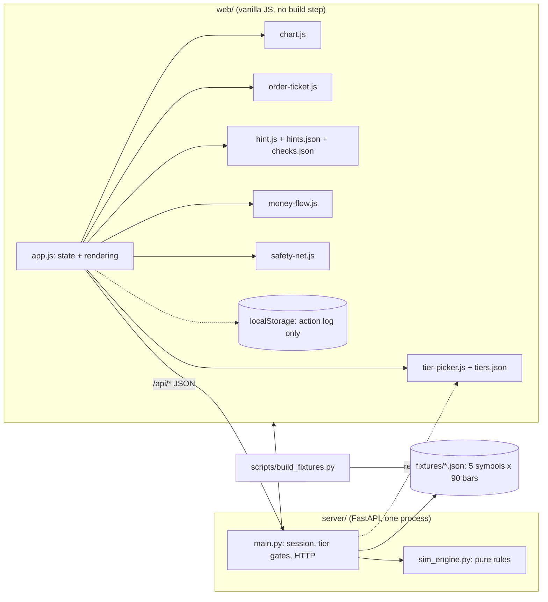

# Rich-HER (Astra Trading): Technical Specification

> **This document is superseded — don't build against it.** It describes an earlier version of the product: a $10,000 account and a "lead with the downside" framing. It was replaced by [SPEC_3.md](../SPEC_3.md). Kept here just for historical context.

**Version:** 3.0 · **Replaces:** version 2.0 (the old Node.js build) · **Status:** the baseline for a practice run. This is the contract the team locks in after a 3–4 week practice build (see [section 0](#0-status-and-scope)).

Rich-HER teaches downside-first risk literacy. A user trades $10,000 of pretend money through a price replay where the future stays hidden, and a one-tap safety net steps in automatically when a position drops 8%.

---

## 0. Status and scope

- **This is the dry-run (practice) build**, called for by an earlier review document called "Optimization Pass 2" (not included in this repo) as its 5th recommended action. It's meant to test the architecture before the actual HackHERS event — it is *not* the hackathon submission itself.
- **Mock data only.** No connection to Alpaca or any live market data. The architecture leaves room for both, but neither is actually built yet.
- **The pre-work rules are still unconfirmed.** Most hackathons require code to be written during the event itself. V2 needs to confirm HackHERS's specific rules before any of this code or content gets reused at the actual event (this was flagged as loophole #9 in Optimization Pass 2). What carries over regardless of the rules: this technical contract, the time estimates, and the lessons learned.
- **Where this came from.** This document is based on the prototype README and on "Optimization Pass 2." A file called `API_CONTRACT.md`, which the prototype README says it follows, wasn't actually available — so section 8 below is a fresh API contract, derived from the behavior that was described elsewhere. If `API_CONTRACT.md` turns up later and differs from this, reconcile the two. Places where the original README was vague, and the interpretation made here, are listed in [Appendix B](#appendix-b-interpretations-to-confirm).

## 1. Core principles

| # | Rule | How it's enforced |
|---|---|---|
| 1 | **Lead with the downside.** Every hint, tooltip, and order confirmation states what you could lose before what the action does: `[What you could lose]. [What it does].` | `server/tests/test_content.py` fails the build if a hint's first field isn't `downside`, or if that downside line doesn't actually name a loss. |
| 2 | **The demo works fully offline.** The table demo runs on localhost with Wi-Fi off. Zero requests to outside servers — no CDN, no web fonts. | Uses only fonts already installed on the computer. `scripts/e2e-browser.mjs` checks that no external `link` or `script` tags load, and that there are zero console errors through the whole flow. |
| 3 | **The simulation core stays pure.** `server/sim_engine.py` has no web framework, no file access, no clock, and no randomness. | It doesn't import anything at all; 25 unit tests exercise it directly, without needing a server running. |
| 4 | **The backend is the single source of truth.** The server holds the real state. `localStorage` (the browser's local storage) only ever holds the server's own action log, so a restarted server can be rebuilt from it. | Every route that changes something returns the full new state; the browser never calculates a trade fill on its own. |
| 5 | **The data is honestly labeled.** Prices are **synthetic** (made up), generated by `scripts/build_fixtures.py`. They're never presented as if they were real market history. | Every fixture file carries `"synthetic": true`, and the UI says "synthetic replay" in the chart title, during onboarding, and in the footer. |

## 2. Architecture



- **A single command** (`uvicorn server.main:app --port 8000`) serves both the API and the browser app together, at `http://127.0.0.1:8000/`.
- **A two-server setup also works**: run `python -m http.server 5500` inside `web/`. CORS (cross-origin requests) is open by default; `app.js` targets `http://127.0.0.1:8000` unless it's being served from port 8000 itself (see [section 13](#13-hosting-and-the-tech-domain)).
- `web/tiers.json`, `web/hints.json`, and `web/checks.json` are read by **both** the browser and the server, so the screen and the server's rules can never fall out of sync with each other.

## 3. Repository layout and who owns what

| Path | Owner | Notes |
|---|---|---|
| `server/` (`main.py`, `sim_engine.py`, `requirements.txt`, `smoke-test.sh`, `tests/`) | **B** only | Python/FastAPI for this dry run. B decides whether to eventually port it to Go/C++ (the four core engine functions are what would actually be worth porting). |
| `scripts/build_fixtures.py` | **B** only | Deterministic (produces the same output every time) and safe to re-run whenever needed. |
| `fixtures/*.json` | **B** only | Generated, never hand-edited — a test compares each file against a fresh build to catch this. |
| `web/index.html`, `index.css`, `app.js`, `chart.js`, `order-ticket.js`, `format.js` | **F** only | `format.js` and `index.css` are additions beyond what the original prototype listed. |
| `web/hint.js`, `hints.json`, `checks.json`, `money-flow.js`, `safety-net.js` | **V1** only | V1 owns the copy and components; F is responsible for wiring `safety-net.js` into `app.js`. `checks.json` is a new addition. |
| `web/tier-picker.js`, `tiers.json` | **V2** only | Onboarding flow, the tier preview, and the tier-gating rules. |
| The pitch deck, Devpost writeup, testing with strangers, the `.tech` domain, HackHERS rules | **V2** | Not code. Nobody is named for this role yet; see [Appendix B](#appendix-b-interpretations-to-confirm). |

The simulation engine was moved from `web/sim-engine.js` to the backend (this was flagged as loophole #1 in Optimization Pass 2). That reduces F's overall workload (loophole #10) and keeps `web/` free of trading rules that would otherwise need to stay in sync with the server.

## 4. Fixtures (the price data)

Five curated companies, each with 90 days of price data in the form `{day, o, h, l, c}` (open, high, low, close). Deterministic: the exact same files get produced on every machine. **No trading volume data**, and **no real calendar dates** (a real date would imply this is actual history).

| Symbol | Personality | Starts on day | Worst drop |
|---|---|---|---|
| **HLX** | Steady climb, then a sharp pullback. Used as the guided demo. | 40 (Day 41) | **−22.7%** (between days 45 and 60) |
| BRW | Slow and steady | 30 | −2.3% |
| KIN | Choppy, with a medium-sized dip | 25 | −15.1% |
| BRD | A broad index fund, shallow dips | 30 | −2.3% |
| VLT | Big swings in both directions | 15 | −28.6% |

**What's inside each file** (e.g., `fixtures/HLX.json`): `symbol`, `name`, `blurb`, `volatility`, `synthetic: true`, `generator {script, seed, version}`, `start_cursor`, `meta {max_drawdown_pct, peak_bar, trough_bar, first_close, last_close, demo?}`, `strategy {name, fast, slow, signals[]}`, `bars[]`.

**How the prices are generated.** Each price path is pinned to a set of hand-chosen "anchor" prices, and randomly generated noise (using a fixed seed, so it's reproducible) fills in the gaps between them — technically, a Brownian bridge, a common way to generate a random path between two fixed points. For HLX specifically, the generator tries different random seeds until every one of these conditions holds (it landed on seed 1001):

- the worst drop is exactly −22.7%, and it spans exactly days 45 through 60; day 45 is the highest closing price and day 60 is the lowest;
- buying at day 40 ($168.00) reaches the −8% safety-net prompt on day 53 while a −10% stop order could still protect the position, and that stop fills on day 54 at exactly $151.20 (no gap).

**The moving-average strategy signal.** A crossover between a 5-day and a 20-day moving average is precomputed once, ahead of time, into `strategy.signals`. Nothing here is calculated live during use. The API only ever returns signal data up to the current day.

Running `python scripts/build_fixtures.py --check` exits with an error if any file is out of date or has been hand-edited.

## 5. Simulation engine (`server/sim_engine.py`)

Pure functions operating on plain data structures. Each day's price data ("bar") is `{o, h, l, c}`. Constants used: `STARTING_CASH = 10000`, `PROMPT_PCT = -8.0`, `STOP_PCT = -10.0`, `MAX_QTY = 10000`. Breaking a rule raises a `SimError(code, message, **extra)`.

| Function | What it does |
|---|---|
| `price_at(bars, cursor)` | Returns the price data for a given day, staying within the bounds of the fixture, along with its index `i` and `day`. |
| `advance(cursor, n, last_bar)` | Returns `cursor + n`, kept within the range `[0, last_bar]`. |
| `validate_order(order, price, cash, position_qty)` | Rejects orders that are malformed, unaffordable, or too large (see the error codes in [section 8.3](#83-errors)). |
| `immediate_fill_price(order, bar)` | For a market order → the day's closing price. For a limit order that's already at a favorable price → the closing price (never worse than the limit). Otherwise `None`: the order just waits, unfilled. |
| `apply_fill(cash, position, side, qty, price)` | Returns `(new_cash, new_position \| None, realized_pnl)`. Buying multiple times averages the entry price together. |
| `check_open_orders_for_bar(orders, bar_index, bar)` | Figures out which waiting orders trigger on this particular day, checked in the order they were created. Orders only trigger on days **after** the one they were originally placed on. |
| `check_safety_net_candidates(positions, price, open_orders, dismissed)` | Finds positions that are down 8% or more at closing, with no safety net already in place and not previously dismissed. |
| `shadow_delta(kept_lots, price)` | Calculates what would have happened if the safety net had been ignored (details below). |
| `portfolio_summary(cash, positions, price)` | Calculates total account value and unrealized profit/loss. |
| `stop_price_for(avg_price, pct)` | `round(avg × (1 + pct/100), 2)`. |

**How order fills work** (using each day's open/high/low/close prices):

| Order type | Triggers when | Fills at |
|---|---|---|
| Market | immediately | that day's closing price |
| Limit buy | `low ≤ limit` | `min(limit, open)`: the limit price, or better |
| Limit sell | `high ≥ limit` | `max(limit, open)`: the limit price, or better |
| Stop (sell only) | `low ≤ stop` | `min(stop, open)`: **if the price gaps down past the stop overnight, it fills at the open — worse than the stop price** |

This gap behavior is intentional: a stop order is not a guarantee of the exact price, and the app's hints say so.

**The safety net.** The prompt appears the moment `(close − avg) / avg ≤ −8%`. The stop order sits at `avg × 0.90`. The `can_protect` flag is false if the price has already fallen past the stop level — in that case, the prompt instead offers "sell right now." Once you choose "keep holding," the prompt won't reappear for that position until it closes out or grows larger.

**The shadow benchmark.** Whenever the safety net sells shares, each lot sold `{qty, fill_price}` is remembered. `shadow_delta = Σ qty × (price_now − fill_price)`. A negative number means the safety net actually saved you money. This gets reported as `saved_by_safety_net` (which equals `−delta`) and shown on screen as "Without your safety net you would have $X." It's honest in both directions — after a price rebound, it will actually say the safety net *cost* you money.

**Fast-forward always stops for important events.** The `advance` function steps forward one day at a time, and **stops early** the moment an order fills or a safety-net prompt appears. Fast-forward can never accidentally skip past a fill or a prompt.

## 6. Session model and recovery

One shared session, kept in the server's memory (no login system, just a single demo session). It tracks: onboarding info (`symbol`, `tier`), `cursor` (which day you're on), `cash`, `positions`, `orders` (each with an id = its position + 1), `trades`, `realized` gains/losses, `dismissed` prompts, `kept_lots`, `events`, `checks_passed`, `first_buy_done`, `safety_net_used`, and `replay_log`.

- **The backend always wins.** Every route that changes something returns `{…, "state": <full snapshot>}`. The browser replaces its entire state with whatever comes back.
- **No looking ahead.** A snapshot only ever contains `bars[0..cursor]`. `GET /api/quote?as_of=n` refuses to return anything if `n > cursor`. `fixture_meta` (which includes the size of the dip) stays `null` until the replay actually finishes.
- **`as_of` acts as a staleness guard.** `POST /api/orders` takes an optional `as_of` day index, and returns a `409 STALE_CURSOR` error if the screen is behind what the server currently has (this addresses loophole #1 from Optimization Pass 2).
- **Recovery works through replay.** The server records every successfully accepted request into `replay_log`. The browser saves `{boot_id, log}` to `localStorage`. On page load, if the server hasn't been onboarded yet **and** the `boot_id` is different from what was saved, that means the server restarted — so the browser replays the saved log through the normal API routes. Because the simulation is deterministic, the session comes back exactly as it was. If the `boot_id` matches, that means someone did an intentional reset, and the log should NOT be replayed.
- **Reset** (`POST /api/reset`) starts a completely fresh session and increments the `participant` counter. The QA testing log survives a reset.

## 7. Tiers and gating

`web/tiers.json` is the single source of truth for this. The server enforces it (returning `403 TIER_LOCKED` if violated), and the screen just mirrors what it says.

| Tier | Order types allowed | Chart shown | Safety net | How to unlock it |
|---|---|---|---|---|
| **1 Foundation** | Market only | Line | One tap, fixed at 10% | Start here by choosing "I'm brand new" |
| **2 Tactical Protection** | + Limit | Line + highest/lowest so far | Choose 5/10/15/20% | Start here by choosing "I've traded before," or pass the **downside** comprehension check |
| **3 Strategic Mastery** | + Stop | Candlesticks + moving-average crossover signals | Same as Tier 2 | Pass the **stop-loss** comprehension check |

**The safety net is a protection, not a reward for progress.** The −8% prompt and the one-tap 10% safety net both work at **every** tier. What tiers actually unlock is *control over* that protection — setting your own percentage, or placing your own stop orders. This resolves an earlier contradiction, where the demo used to trigger a safety net at Tier 1 while the white paper described stops as a Tier 2 feature.

**The tier preview.** Tapping a locked tier shows a **read-only preview** — its chart, with its order options visible but disabled — along with a banner explaining how to actually unlock it. It never changes your real tier. When presenting, say this line once: *"This previews what she unlocks. It isn't a shortcut."* (This addresses loophole #7 from Optimization Pass 2.)

## 8. API contract

JSON over HTTP. **12 live routes + 2 mock-only stub routes = 14 total**, and that count is locked in and checked by a test called `test_route_table_is_frozen_at_12_live_plus_2_stubs`. Anything that requires an active replay returns `409 NOT_ONBOARDED` if called before onboarding is complete.

### 8.1 Routes

| # | Route | Body / query | What a successful response looks like |
|---|---|---|---|
| 1 | `GET /api/state` | none | The full snapshot ([8.2](#82-the-snapshot)). |
| 2 | `POST /api/onboarding` | `{experience: "new"\|"experienced", symbol?: "HLX"}` | `{state}`. Choosing `new` sets Tier 1; `experienced` sets Tier 2. `cursor` starts at that symbol's `start_cursor` day. |
| 3 | `POST /api/advance` | `{n: 1..30}` | `{advanced, events[], state}`. Stops early if a fill happens or a prompt appears. |
| 4 | `POST /api/orders` | `{symbol, side, type?, qty, limit_price?, stop_price?, as_of?}` | `{order, fills[], state}`. |
| 5 | `DELETE /api/orders/{id}` | none | `{order, state}` (cancels a still-waiting order). |
| 6 | `POST /api/safety-net` | `{symbol, decision?: "accept"\|"dismiss", percent?, stop_price?}` | `accept` → `{order, state}` (creates a sell-stop for the whole position). `dismiss` → `{state}`. |
| 7 | `POST /api/comprehension` | `{check_id, choice}` | `{correct, attempt, explanation, unlocked_tier, state}`. |
| 8 | `POST /api/reset` | none | `{state}` (back to un-onboarded, moves to the next participant). |
| 9 | `GET /api/quote` | `?symbol=&as_of=` | `{symbol, as_of, price, bar}`. Defaults to today; refuses to return a future day. |
| 10 | `GET /api/portfolio` | none | `{as_of, cash, positions[], equity, market_value, unrealized_pnl, unrealized_pnl_pct, realized_pnl, open_orders[]}`. |
| 11 | `GET /api/tiers` | none | `{tiers[], active, unlocked[]}`. |
| 12 | `GET /api/qa-log` | none | `{participants, per_check, pitch_line, entries[]}`. |
| 13 | `GET /api/news` | `?symbol=` | **Stub route:** `{stub: true, items: []}`. |
| 14 | `GET /api/fundamentals` | `?symbol=` | **Stub route:** `{stub: true, fundamentals: null}`. |

`side` and `type` accept either uppercase or lowercase. `type` defaults to `MARKET`. `type: "STOP"` can only be used for selling. `POST /api/safety-net` with a custom `percent` (other than 10) or a `stop_price` requires Tier 2 or higher.

### 8.2 The snapshot

`state` is the exact same object structure everywhere it appears. The key fields (all present even before onboarding, with empty default values):

```jsonc
{
  "boot_id": "a3f1c2d9", "onboarded": true, "participant": 1, "action_seq": 2,
  "symbol": "HLX", "tier": "beginner", "tiers_unlocked": ["beginner"],
  "cursor": 40, "day": 41, "total_days": 90, "finished": false, "price": 168.0,
  "bars": [ { "day": 1, "o": 150.13, "h": 150.86, "l": 149.27, "c": 150.0 } /* … up to today */ ],
  "strategy": { "name": "MA crossover (5/20)", "signals": [ /* up to today */ ] },
  "cash": 8320.0, "equity": 10000.0, "total_pnl": 0.0, "total_pnl_pct": 0.0,
  "unrealized_pnl": 0.0, "unrealized_pnl_pct": 0.0, "realized_pnl": 0.0,
  "positions": [ { "symbol": "HLX", "qty": 10, "avg_price": 168.0, "price": 168.0,
                   "market_value": 1680.0, "unrealized_pnl": 0.0, "unrealized_pnl_pct": 0.0,
                   "protected": false, "stop_price": null } ],
  "open_orders": [], "trades": [],
  "shadow": { "active": false, "kept_qty": 0, "equity": 10000.0, "delta_vs_you": 0.0, "saved_by_safety_net": 0.0 },
  "prompts": [],            // safety-net candidates; if non-empty, this blocks /api/advance
  "pending_check": "downside", "checks_passed": [],
  "events": [ { "seq": 2, "day": 41, "type": "FILL", "message": "Day 41: bought 10 HLX at $168.00." } ],
  "replay_log": [ { "method": "POST", "path": "/api/onboarding", "body": { "experience": "new", "symbol": "HLX" } } ],
  "fixture_meta": null      // filled in with { max_drawdown_pct, synthetic } only once the replay finishes
}
```

A safety-net prompt (from `prompts[]`), exactly as the modal window would receive it (HLX bought at $168.00, on Day 54):

```json
{ "symbol": "HLX", "qty": 10, "avg_price": 168.0, "price": 154.17, "loss_pct": -8.23,
  "loss_dollars": -138.3, "stop_price": 151.2, "stop_pct": -10.0, "stop_loss_dollars": -168.0,
  "can_protect": true }
```

### 8.3 Errors

Every error comes back as `{"error": CODE, "message": "plain English", ...extra}`.

| Status | Code | What it means / what to do |
|---|---|---|
| 400 | `INVALID_ORDER`, `UNSUPPORTED_ORDER` | A malformed order, or trying to place a buy-stop order (not supported). Fix the fields. |
| 400 | `INSUFFICIENT_FUNDS`, `INSUFFICIENT_SHARES` | Comes with `required`/`available` or `requested`/`available` fields. |
| 400 | `STOP_NOT_BELOW_MARKET` | A stop-loss order must be set below the current price. |
| 400 | `SYMBOL_MISMATCH`, `FUTURE_BAR`, `INVALID_CHOICE` | Wrong symbol, a day that hasn't happened yet, or an option that doesn't exist. |
| 403 | `TIER_LOCKED` | Comes with `required_tier`; the message explains how to unlock it. |
| 404 | `UNKNOWN_SYMBOL`, `ORDER_NOT_FOUND`, `NO_POSITION`, `UNKNOWN_CHECK` | |
| 409 | `NOT_ONBOARDED`, `ALREADY_ONBOARDED` | Complete onboarding first, or reset first. |
| 409 | `REPLAY_FINISHED` | The last day of the replay has already been reached. |
| 409 | `PROMPT_PENDING` | You need to respond to the safety-net prompt before time can advance. Comes with `prompts`. |
| 409 | `STALE_CURSOR` | The client's `as_of` value is behind what the server currently has. Comes with `cursor` — refresh your state. |
| 409 | `ORDER_NOT_OPEN`, `ALREADY_PROTECTED`, `CHECK_NOT_AVAILABLE` | |
| 422 | `VALIDATION` | The request body or query failed validation; `details[]` lists each `{field, message}`. |

## 9. The teaching loop: comprehension checks and the QA log

Two comprehension questions (written in `web/checks.json`, V1's copy). A question appears once its trigger condition happens, and stays visible until answered correctly. Wrong answers get an explanation and another attempt; **every single attempt gets logged**, right or wrong.

| Check | Triggers when | Question (shortened) | Unlocks | Pitch line label |
|---|---|---|---|---|
| `downside` | after the first buy | "$1,000 falls 10%: what is it worth?" | Tier 2 | "worked out their downside after one simulated trade" |
| `safety_net` | after a safety net is set | "What does a stop-loss do?" | Tier 3 | "explained how a stop-loss works" |

`GET /api/qa-log` totals up first-attempt correctness for each check, across all participants (a reset separates participants; the log survives resets) and builds the pitch line automatically, e.g. *"4 of 5 first-time users explained how a stop-loss works."* This is V2's evidence for the stranger-testing results (addressing loophole #8 from Optimization Pass 2). The answer key ships in a plain static file, so this is **not** a proctored, secure exam — actual testing with strangers should happen in person.

## 10. Interaction specs

### 10.1 The Tap-to-Explain order ticket (`order-ticket.js`)
1. **At rest.** Buy / Sell buttons, order type, quantity. Order types that are locked are still visible, and say where they unlock ("Limit … (unlocks at Tier 2)").
2. **Tap Buy or Sell → a review step appears.** An amber-colored box shows the hint for that action and tier (leading with the downside), followed by "Most you could lose on this order: **$1,680.00**" (10 shares × $168.00), with a plain-language note.
3. **The Confirm button is locked for 1.5 seconds** (`CONFIRM_LOCK_MS`) while the risk information is on screen. Changing the order type re-locks it, since the risk level changed too.
4. **Tapping Confirm** sends `POST /api/orders`, including `as_of`. If it fails, the server's error message is shown and the ticket stays open.

### 10.2 The money-flow summary line (`money-flow.js`)
One plain-English sentence under the chart, always leading with what could be lost: *"$1,680.00 of your $10,000.00 is in HLX, and that part can lose value."* After a safety-net sale: *"Your safety net sold 10 HLX at $151.20, locking in a $168.00 loss. Had you kept those shares you would be $182.40 worse off today."*

### 10.3 The safety-net prompt (`safety-net.js`)
Every number shown comes directly from the candidate object — nothing is hardcoded. Here's the exact wording used for the demo position:

- **Title:** "Your HLX position is down 8.2%"
- **Body:** "You bought 10 HLX at $168.00. It is now $154.17, so you are down $138.30 (−8.2%). Prices can keep falling."
- **Callout:** "If HLX falls to $151.20 (10% below your entry), your shares are sold automatically. That caps this loss at $168.00. If it dips there and bounces back, you will have sold at the bottom."
- **Primary button (uses this exact label everywhere it appears):** "Protect my position (sell at $151.20)"
- **Secondary button:** "Keep holding (accept the full risk)"
- If `can_protect` is false, the primary button instead reads "Sell my 10 shares now ($X each)".
- The modal blocks fast-forward while it's open (the server returns `PROMPT_PENDING`). It has no "click away to dismiss" behavior.

### 10.4 Onboarding (`tier-picker.js`)
Two questions on one card: experience level (`new` / `experienced`), and a choice of five companies (HLX is pre-selected, and marked as the guided walk-through). States clearly that the prices are synthetic.

## 11. The hints contract (`hint.js`, `hints.json`)

```ts
getHint(hints, actionId: string, tier: 'beginner'|'intermediate'|'advanced')
  -> { downside: string, text: string, more?: string }
```

- Each entry is keyed by `actionId.tier` (for example, `order.buy.beginner`). A missing tier falls back to the nearest lower tier first, then the nearest higher one, and finally to a generic downside-first line — it can never accidentally return upside-only wording.
- `downside` is always the first field, and must always name an actual loss. **`hints.json` is currently a first draft — V1 still needs to reread every line.**
- Action IDs currently in use: `order.buy|sell|limit|stop`, `safety_net.prompt|stop_loss`, `chart.line|levels|candlestick|strategy`, `portfolio.cash|position|pnl|shadow`. Any element with a `data-hint="<actionId>"` attribute automatically gets an (i) info button.

## 12. The demo script (2:15)

Clock notation: **T+m:ss** is time elapsed since the demo started. **H+n** refers to the hackathon's overall event clock. Every number below is checked automatically by a test called `test_guided_demo_beat_end_to_end`.

| T+ | Step | What you do | What appears on screen |
|---|---|---|---|
| 0:00 | **1. Introduction** | Reset → choose "I'm brand new" + HLX → Start | Tier 1, Day 41, $10,000.00, HLX line chart, future hidden. |
| 0:25 | **2. The downside-first buy** | Tap **Buy**, 10 shares, wait for the lock to release, then Confirm. Answer the quick comprehension question ("$900") | The downside box shows "Most you could lose: $1,680.00". Fill happens at **$168.00**, cash drops to $8,320.00. Tier 2 unlocks. |
| 1:00 | **3. Tier preview** | Tap "3. Strategic Mastery," say the sentence from [section 7](#7-tiers-and-gating), then exit the preview | Shows candlesticks and moving-average signals as a read-only preview. |
| 1:20 | **4. Walking into the dip** | **Fast-forward.** It stops on its own. Tap **Protect my position** | Day 54, price is **$154.17**: "down 8.2%… down $138.30." Safety net set at **$151.20**. |
| 1:45 | **5. The crash, and the protection working** | **Fast-forward** again (the net sells automatically), then advance 5 more days, then 1 more | Day 55: sold at **$151.20**, locking in **−$168.00**. Day 61: price is **$132.96**; message reads "Without your safety net you would have $9,649.60: it saved you **$182.40**" ($18.24 per share). |

**If asked what happens if you keep going:** by Day 90, the price recovers to $158.00 and the shadow-benchmark line flips — keeping the shares would actually have left her **$68.00 ahead**. That's the honest cost of protection, and it's the honest version of the pitch.

## 13. Hosting and the `.tech` domain

The site will eventually live on a `.tech` domain. This reintroduces a dependency on the internet that "Optimization Pass 2" specifically recommended cutting (loopholes #6 and #9): venue Wi-Fi issues must never be able to take down the pitch.

| Do | Don't |
|---|---|
| Claim or register the `.tech` domain **before** the event (usually available as a sponsor perk through Get.tech or Namecheap — just a form to fill out, not any code). | Wait until the event itself to figure out how to get the domain. |
| Deploy it **once, near the end**, purely as a Devpost/judge follow-up link. | Make the live table demo depend on it being up. |
| Run the table demo on **localhost, with Wi-Fi off**, exactly as this repo is set up. | Present from the hosted URL — one bad moment of venue Wi-Fi can kill the whole pitch. |
| Point DNS wherever you deploy: Vercel or Netlify for `web/`, Render or Fly.io for the backend. | Host the frontend and backend on the same box, unless one specific person owns the DNS and deployment end-to-end. |

**Setting up a split hosting deployment.** `app.js` reads its API address from a `?api=https://…` URL parameter first, then from `window.RICHHER_API`, and finally falls back to the same origin on port 8000, or `http://127.0.0.1:8000`. Set `RICHHER_CORS_ORIGINS` (comma-separated) on the backend so it stops using a wildcard `*` for CORS. **A known limitation:** the server only keeps one shared demo session, so every visitor to a hosted link shares the exact same session. That's fine for a judge briefly looking around, but not built for multiple concurrent users.

| # | Action | Owner | Deadline |
|---|---|---|---|
| 6 | Confirm how the `.tech` domain gets claimed (a sponsor form vs. buying it directly) and who owns the DNS | V2 | This week |
| 7 | Pick where to deploy (a frontend host + a backend host), so B and F aren't left guessing mid-event | Team lead (AJ) | 2 weeks |

## 14. Testing and success metrics

```bash
python -m pytest                        # 60 tests: engine, fixtures, API + flows, content checks
bash server/smoke-test.sh               # every route against a running server, then the unit tests
python scripts/build_fixtures.py --check
node scripts/e2e-browser.mjs            # optional: runs the whole flow in a headless browser (needs Node 22+, Edge/Chrome)
```

`e2e-browser.mjs` drives the actual UI through onboarding, the buy, both comprehension checks, the tier preview, fast-forwarding into the drawdown, the safety net triggering, a server restart (confirming the session gets restored), an intentional reset (confirming it does NOT get resurrected), the two-server setup, and the "server is down" message. It fails on any console error, and it **resets the session on port 8000** as part of running — so always run it on a scratch server, never on the one you're actually about to demo from.

| Metric | Target | Where it's measured |
|---|---|---|
| Demo runs clean with Wi-Fi off | 3 out of 3 rehearsals | Team, on the actual presenter laptop |
| Demo length | 2:30 or under | [Section 12](#12-demo-script-215)'s budget is 2:15 |
| Stranger comprehension | 4 out of 5 or better, first try | `GET /api/qa-log` → `pitch_line` |
| Hints lead with the downside | 100% of them | `test_content.py` (automatically enforced) |
| Devpost submitted | By hour 22, not right at 23:59 | V2 |
| Tracks entered | Every one the team qualifies for | V2 |

## 15. Out of scope (deliberately cut for now)

Connecting to Alpaca or any live trading API (the architecture supports it — worth one line in the Devpost writeup) · deploying *during* the actual event (see section 13) · wiring `/api/news` and `/api/fundamentals` into the UI (they exist only as stub routes for now) · free-text company search (limited to five curated companies) · saving data beyond the in-memory session (no login system) · calculating trading strategies live (the moving-average crossover is precomputed ahead of time) · jumping backward or forward to an arbitrary day (the replay only ever moves forward, one day at a time).

---

## Appendix A: How this addresses Optimization Pass 2's findings

| # | The issue that was found | Where it's resolved |
|---|---|---|
| 1 | "Walk into the dip" had no actual engine behind it | `server/sim_engine.py` (§5); the `as_of` field on orders (§6, §8) |
| 2 | The safety-net prompt had no spec or clear owner | §5, §10.3; V1 owns the copy/component, B owns the engine, F wires it together |
| 3 | Hints led with the upside instead of the downside | `hints.json` was rewritten; a check was added in `test_content.py` (§11) |
| 4 | The hint system ignored which tier the user was on | `getHint(actionId, tier)` (§11) |
| 5 | Confusion between "tap to explain" and "tap to execute" | §10.1 |
| 6 | Connecting to Alpaca has negative value right now | Cut (§15); worth one line in the Devpost writeup |
| 7 | The tier preview contradicted the "structural" unlocking idea | Made it a read-only preview, plus the spoken script line (§7) |
| 8 | A single comprehension question was weak evidence of learning | Two checks + the `/api/qa-log` pitch line (§9) |
| 9 | About 5 months of runway, but the plan treated it like 5 days | The dry-run status and pre-work rule (§0); an action item for V2 |
| 10 | F (the frontend developer) was overloaded with work | The engine now lives in `server/` instead (§3) |
| 11 | Two different sources of truth existed (client and server) | The backend always wins; the replay log + `boot_id` handle recovery (§6) |
| 12 | The route count kept being described inconsistently | Locked at 12 + 2, and checked automatically by a test (§8) |
| 13 | Team composition was described inconsistently | Still open: [Appendix B](#appendix-b-interpretations-to-confirm) |
| 14 | No success metrics existed | §14 |

## Appendix B: Interpretations that still need confirming

The prototype README was vague in a few places. These are the calls that were made here — each is a single place to go change if one of these turns out to be wrong.

1. **`API_CONTRACT.md` was never provided.** Section 8 above was derived from the behavior described elsewhere.
2. **The shadow benchmark** was interpreted as the counterfactual outcome of ignoring your safety net (§5). The README never actually defined this term.
3. **The money-flow line** was interpreted as the single plain-English sentence under the chart (§10.2).
4. **What the comprehension checks unlock** (§7, §9): the checks unlock Tiers 2 and 3. The README mentioned that a check exists, but not what passing it should actually unlock.
5. **"Alternate onboarding branch"** was interpreted as "I've traded before," which starts the user at Tier 2.
6. **The safety net works at every tier**, and what changes with tier is control over it (§7). This resolves the Tier 1 vs. Tier 2 contradiction that existed in the older docs.
7. **Stops fill at the opening price when the price gaps past them overnight** (§5). This is more honest than pretending they'd fill exactly at the stop price.
8. **Synthetic, anchor-pinned price data** (§4). Exact demo prices are only possible because the data is generated, not recorded from a real market.
9. **`/api/alpaca/status` and `/api/history/summary`** from version 2.0 have been removed; the two remaining stub routes are now `/api/news` and `/api/fundamentals`, matching the prototype README.
10. **Team composition.** The old README named four people for five roles, and this review raises the question of whether there should be one or two frontend developers. The V2 role (deck, Devpost, testing, domain) currently has no named owner. AJ needs to resolve this (see action item #2).
